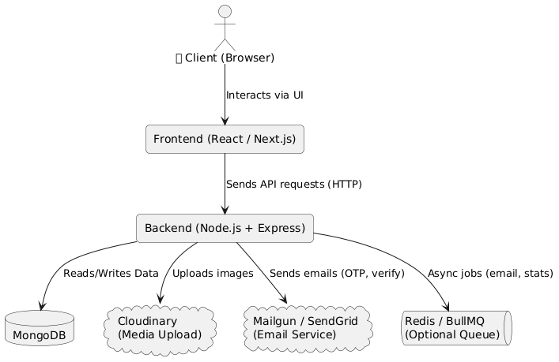
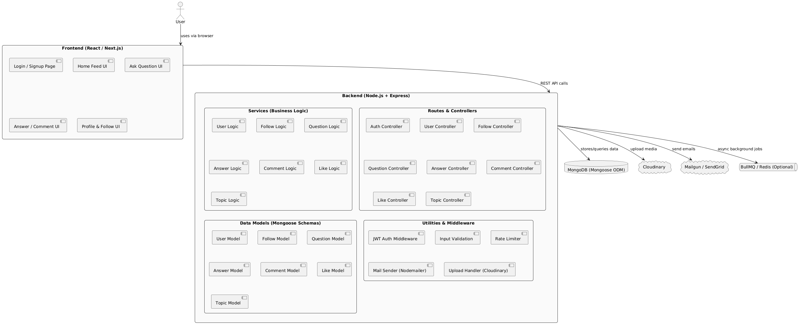
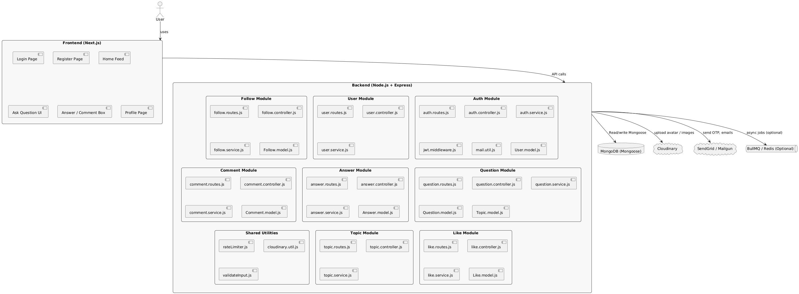

Here’s a clear **description of each diagram** in your `Design/` folder so you can include them in your `README.md` or documentation:

---

### 1. **`highlevelArchitecture.png`** — 🧭 *High-Level Architecture*

  **What it shows:**
  This diagram gives an **overview** of the entire system — how the frontend, backend, and external services interact.

* **User (Browser)** interacts with the React/Next.js frontend.
* **Frontend** sends HTTP API requests to the Node.js/Express backend.
* **Backend** communicates with:

  * MongoDB (data storage)
  * Cloudinary (media uploads)
  * Mail services like Mailgun/SendGrid (email/OTP)
  * Redis + BullMQ (for optional background jobs)

> **Purpose:**
> Understand how core parts of the system are connected from a top-level view.

---
## 🧱 High-Level Architecture

### 2. **`Architecture.png`** — 🏗️ *Layered Monolithic Architecture*

> **What it shows:**
> Breaks down the **backend structure** into logical layers:

* **Routes**
* **Controllers**
* **Services (Business Logic)**
* **Models (Mongoose Schemas)**
* **Utilities & Middleware**

Also shows how the frontend communicates with backend routes and how backend components connect to MongoDB, Cloudinary, Mailgun, etc.

> **Purpose:**
> Clarifies **internal structure** of the monolith — ideal for developers building or debugging the system.

## 📐 System Architecture

### 3. **`DeepArchitecture.png`** — 🧱 *Detailed File-Level Module Breakdown*

> **What it shows:**
> A **deep dive** into the backend showing **actual file names and structure**, such as:

* `user.routes.js`, `user.controller.js`, `user.service.js`, `User.model.js`
* Each module (Auth, Question, Comment, etc.) is isolated and self-contained

> **Purpose:**
> Helpful for onboarding new devs or planning refactors. Mirrors your real folder/code organization.

## 🔩 Deep Backend Architecture

### 4. **`ER_Diagram.png`** — 🔗 *Entity-Relationship Diagram (MongoDB)*

> **What it shows:**
> The **schema-level relationships** between all entities:

* Users ask Questions
* Questions have Answers and Comments
* Users can Like any entity (Question/Answer/Comment)
* Users can Follow each other
* Questions are tagged with Topics

> **Purpose:**
> Perfect for understanding how your MongoDB collections are structured and how documents are connected.

## 🧠 Entity Relationship Diagram (ERD)

<!-- User Auth building -->
### User API
        - REPOSITORY LAYER
            - findUserByEmail
            - findUserByUsername
            - createUser
            - updateUser
            - findUserById
            
        Service Layer
            - login
            - register
            - me
            - updateProfile
            

### POST API
        - REPOSITORY LAYER
            - findPostById
            - createPOst
            - updatePost
            - DeletePost
            - getAllPost
            -getPostById
            
        Service Layer
            - createPOST
            - UPdatePOST
            - DELTEPOST
            - READ
            
